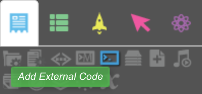
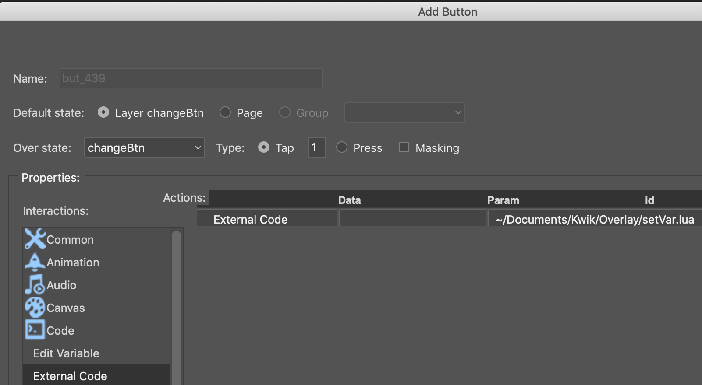

* myListener.lua in the page's external code
    ```lua
    ---
    Runtime:addEventListener( "myEvent", function(event)
            print("event.text")
        end)
    ---
    ```

    

* myDispatcher.lua in the button of overlay

    ```lua
    ---
    Runtime:dispatchEvent({ name="myEvent", text="Changed By dispatchEvent" })
    ---
    ```

    


Alternatively use a global varibale set with Kwik

* myListener.lua in the page' external code
    ```lua
    ---
    Runtime:addEventListener( "enterFrame", function(event)
            print(_K.myVar)
        end)
    ---
    ```

* myDispatcher.lua in the button of overlay
    ```lua
    ---
    local _K = require 'Application'
    _K.myVar = "Changed From Overlay"
    ---
    ```
