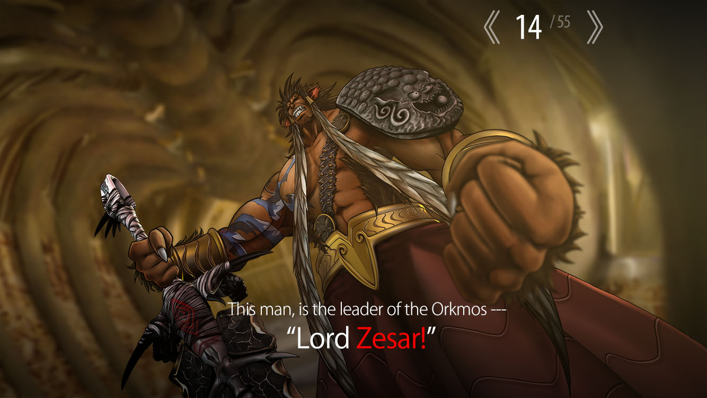

# What is Kwik?
<div style="text-align: right;">
Naoya Yamamoto Jan 2022
</div>

```
A plugin for Adobe photoshop - Kwik simplfies the creation of interactive storytelling apps for iOS, Android, HTML5, Mac&Windows computers.
Kwik prdouces source codes and image assets for Solar2D game engine that builds application binaries.
```

>Solar2D is a a fully open source project https://solar2d.com/

* App Development

* Multilingual is supported

    

* What is Kwik? - Youtube video

    [](https://www.youtube.com/watch?v=jVq3fiwP2tQ)

* UI
    * Kwik Panel

        

    * New Project

        

    * Animation tool

        

    * Setting

        

---
## Digital Publishing Market in 2018
* Artifacts for consumers
    * Storybooks/Comics(Manga)
        * mini games
    * Book Store
        * Update chapters/books/ all within a simple book store to maximize revenue and distribution
* Monetization
    * Paid Apps
    * In-App Purchase
    * In-App Ad
    * Subscriptions

* $15.7 billion in 2016 from [Global E-book market revenue, by genre, 2014 - 2024](
https://www.hexaresearch.com/research-report/e-book-market)

* bookstore apps/services of other companies
    * [kidoz](http://kidoz.net/)
    * [pickatale](https://www.pickatale.com/)
    * [mori no ehon](http://ehonkan.jp/) (Japan)

* [Amazon FreeTime Unlimited for Apple store](https://techcrunch.com/2018/06/22/amazon-freetime-unlimited-finally-lands-on-apples-app-store/)
    * [Fire HD Kids 10](https://techcrunch.com/2018/06/28/amazon-adds-a-10-inch-tablet-to-its-line-of-kids-products/)

* Global E-book market revenue, by genre, 2014 - 2024 (USD Billion), Hexa Resarch

    


* Kidoz content. Image Credit belonged to Kidoz

    

* pickatale content. Image Credit belonged to picatale

    

* mori no ehon.  Image Credit belonged to I-FREEK MOBILE INC.

    


You can see more in [Book store research](bookstores.md)

---
### Programming Market in 2018
* Time to Market is Key
    * Most creatives don't code
    * Interactive programming is hard
    * Photoshop users reach = 43 M(non coders) in 2013
        * [Adobe Creative Cloud Adoption Grows to 12 Million Paid Members in 2017](https://prodesigntools.com/creative-cloud-one-million-paid-members.html)
    * Leverage existing contents/re-purpose/re-cycle
    * From simple to complex interactivity


* [Game programmer salaries start around USD $44,000 annually](https://www.gameindustrycareerguide.com/video-game-programmer-salary/)

    


* [Game artist salaries start around USD$35,000 annually](https://www.gameindustrycareerguide.com/video-game-artist-salary)

    

* [Adobe Creative Cloud Growth](https://prodesigntools.com/links/content/dam/acom/en/investor-relations/pdfs/71306102/ji83maQk1pI8.pdf)

    


----
## No-Code Tool
* **Disrupts** Traditional Publishing - not need to hire/ir staff up costly traditional programmers
* Aspiring JK Rowling's authors don't need to learn how to code or pay publishers to get into the digital market. They get to keep major % share
    * DIY or hire a creator instead of a traditional programmer
    * better to ride on Kwik/Corona SDK in the cross platforms
* creators or non-programmers earn by means of developing apps

---
## [Designing Self Publishing](https://kwiksher.com/doc/design/)

* "Build your own dreams, or someone else will hire you to build theirs" -- Farrah Gray

* Kwik is the tool for the self publishing apps
    * No Revenue Share
    * Creating an app inside Photoshop
    * Free to download and to start making an app.

---
## Showcases

You can see great storybooks made with Kwik in [Kwik showcase](https://kwiksher.com/showcase/)

* [Scribbaloo Train](https://kwiksher.com/portfolios/scribbaloo-train/) from [Scribbaloo Limited](http://scribbaloo.com/index.html)

    

* [Visual Adventure Story - beastly-crusader](https://kwiksher.com/portfolios/beastly-crusader/) from [EpicPuzzle](https://epicpuzzle.wordpress.com/)

    


Not listed in the show case but this is the recent app made with Kwik from [TangibleFun](http://www.tangiblefun.com)
* [Instruments sounds app](http://www.tangiblefun.com/instruments-sounds-app/)

    

Mnejik-Pot is a bookshelf styled app which multi lingal languages are supported

* [Menjik-Pot](https://apps.apple.com/us/app/menjik-pot/id1489566468)

   


---
## Samples in Tutorial of Kwik

Recently added
* [Speech To Text, Text To Speech](https://kwiksher.com/doc/kwik_tutorial/audio/voice2text/)

    

* [Simple Comic](https://kwiksher.com/doc/kwik_tutorial/page_controls/comic_simple/) (HTML5)

    

* [Reading Photo image and camera to read QR Code](https://kwiksher.com/blog/2018/06/04/photo-image-and-qr-scanner/)

    

Coming soon

* Fb Instant Game

    

You can download each sample project of [kwik Tutorial](https://kwiksher.com/doc/kwik_tutorial/)

* Animations
    * Auto Flip
    * Infinity Scroll
    * Particles
    * Spine Animation
    * Working with SpriteSheet

* Audio
    * Recording
    * Voice2Text

* Interactions
    * Dragging with Flip
    * Drawing Canvas
    * Keyboard
    * Magnetic Drop
    * Scroll Objects and Text Replacements

* Media
    * QR Scanner
    * Photo Masking
    * Video

* Network
    * In App Purchase
    * Download Images
    * Posting SNS
    * Page Controls
    * Menu overlay
    * Navigation
    * Saving variables
    * PageCurl
    * Parental control

* Physics
    * Making physics objects
    * Ragdoll

* Read to Me
    * Read to me basic
    * Multilingual project

* Bookshelf
    * pages
    * embedded
    * template

---
## Kwiksher

https://kwiksher.com

* Contact
    * support@kwiksher.com
    * Social
        * https://www.facebook.com/kwiksher/
        * https://twitter.com/kwiksher

* Naoya Yamamoto

    https://github.com/kwiksher

    * Software Engineering
        * Solar2D (Lua, C++, C)
        * iOS (objective-c, swift)
        * Android(java, kotolin)
        * Wordpress (PHP)
        * Adobe ExtendedScript (JSX)
            * HTML5 (CSS, JQuery, React, Angular, Vue)
        * Node.js (typescript)
        * Adobe Photoshop
        * Adobe Animate
        * Spine
    * QA & Support
    * Biz/Account Management
    * Personal Experience is here in LinkedIn [@ymmtny](https://www.linkedin.com/in/ymmtny/)

        * As an embedded software enginneer, Yamamoto spent almost 10 years in development of Japanese mobile phones with Adobe FlashLite player 2002-2013
        * 2014-, taking management & develoment of Kwiksher.


* History
    * Feb 2022
        * Kwik 4.5 All the features of Kwik4 is free.
    * June 2018
        * Kwik 4.1 update

    * Dec 2017
        * 31st of December, Kwik 3.x official support ended

    * November 2016
        * Kwik 4.0 release

    * November 2014
        * Kwiksher LLP started in Tokyo.
    * September 2014
        * Kwiksher is under new management and [Alex’s farewell](https://kwiksher.com/blog/2014/09/02/kwiksher-future/)
        * Naoya Yamamoto is taking over all the products and the services of Kwiksher LLC.

    * May 2011
        * Kwiksher LLC was founded by Alex Souza as a company in Florida, February of 2012, although it has started “officially” with the launch of Kwik 1.0 in May of 2011
---
## Reference Information - Flash Alternatives

* Facebook Incubator > [Keyframes](https://facebookincubator.github.io/Keyframes/)
    * An exporting script that extracts image animation data from an After Effects composition.
    * A corresponding rendering library for Android and iOS.
* [Airbnb Lottie](https://airbnb.design/lottie/)
    * iOS, Android, and React Native library
    * It renders After Effects animations in real time,
        * [Introducing Lottie](https://airbnb.design/introducing-lottie/)
        * [BodyMovin](https://github.com/bodymovin/bodymovin)

* [SpriteStudio](http://www.webtech.co.jp/eng/spritestudio/)

* [Live2D](http://www.live2d.com/en/products)

* [Spine](http://esotericsoftware.com/)

* [Cocos Creator](http://www.cocos2d-x.org/creator)

* [Unity for 2D](https://unity.com/solutions/2d)

## Solar2D Game Engine

https://solar2d.com/

* [Wikipdia Solar2D](https://en.wikipedia.org/wiki/Solar2D)

    Solar2D (formerly Corona SDK) is a free and open-source, cross-platform software development kit originally developed by Corona Labs Inc. and now maintained by Vlad Shcherban.

* [The Best 15 Mobile Game Development Platforms & Tools in 2018](https://thetool.io/2018/mobile-game-development-platforms)

    Corona SDK is a cross-platform that uses the Lua scripting language which is pretty easy to learn and code with. You can make use of its 2D features and find many plugins in the Corona Market place. Corona is famous for their clear documentation and their supportive and active community. It also brings a real-time simulation that will help you to see how your app will look like after changes.

* [Top 5 Tools for Mobile Game Development](https://www.newgenapps.com/blog/top-sdk-tools-for-mobile-game-development)

    One downside with Corona is that it can only be used for 2D game development. It has limited to no capabilities in 3D gaming, VR or AR. If you are planning to create an AAA game then this platform might feel a little limiting.

* [What are the best 2D Lua game engines?](https://www.slant.co/topics/2590/~2d-lua-game-engines)

* [Lua Programming](https://www.lua.org/about.html)
    * [where-lua-is-used](https://sites.google.com/site/marbux/home/where-lua-is-used)
    * [Comparison of programming languages](https://en.wikipedia.org/wiki/Comparison_of_programming_languages)
        * Imperative
        * Object orientated
        * Functional
        * Procedual
        * Not Generic
        * Reflective
        * Not Eventdriven

    Lua doesn't have explicit "object" type (more general type of "table" is used for object definition), but does have explicit syntax for object method calling
