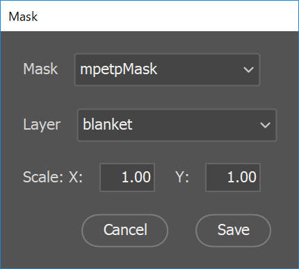

# https://superuser.com/questions/213336/using-graphicsmagick-or-imagemagick-how-do-i-replace-transparency-with-a-fill-c

```
FILENAME=~/Documents/Kwik/HelloWorld/build4/assets/images/p1/hello@4x.png
OUT=~/Documents/Kwik/HelloWorld/build4/images/p1/hello_mask@4x.jpg

 gm convert "$FILENAME" -background black -extent 0x0 +matte -threshold 20% "$OUT"

 gm convert "$OUT" -resize 68x60 -background black -gravity center -extent 100x100  "$OUT"
```

