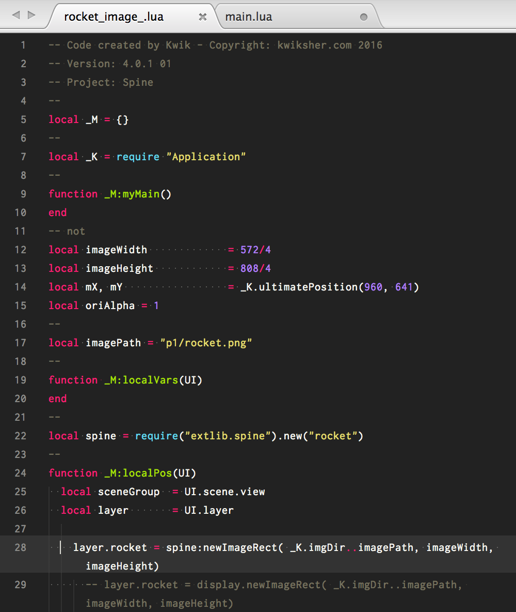

# Spine 

Spine is an animation tool that focuses specifically on 2D animation for games

* http://esotericsoftware.com/spine-quickstart

Photoshop-LayersToPNG.jsx exports images in a layer group. You can import the exported images to Spine

* https://gist.github.com/NathanSweet/c8e2f6e1d79dedd56e8c

Let's create a rocket animation.
Sample project is here. 

* ./img/spine/Spine.zip

Steps
1. Create a new Kwik project
1. A layer group - rocket consists of body, wingR, wingL and tale
1. export the 'rocket' layer group with LayersToPNG.jsx
1. Open Spine and create a new spine project and import the parts of rocket
1. Make animations in Spine
1. Export the spine project. It outputs json, atlas and png files.
1. Kwik to publish the project and preview it with Corona simulator.
1. Create a custom file of rocket_image.lua to use the files(json, atlas, png) from Spine.
1. Publish again to make the custom file enable to work

## LayersToPNG
creating a new Kwik project and exporting the rocket parts with LayersToPNG.js

you can find layer png files and <strong>page1.json </strong>

Open Spine and import data. You can set page1.json from Browse button and set Skeleton name as" rocket". Then click OK

If Missing is displayed, you need to set the correct images folder

Set the images folder path from Tree Panel &gt; Images &gt; Path

select images folder and click Open to set the images folder.

Now the images are displayed

## Spine
You don't need to use  background image. So make it uncheck "Export". I modified the background color transparent to focus the rocket.

Set the center to the origin. This is important for importing the spine animation later to Kwik/Corona

### Making bones

Making animations. I named the animation as <strong>"animation"</strong>

### Export

Select JSON and Create atlas checked. Output folder is <strong>"build4/assets/sprites"</strong>

In the sample project, you can preview it with Corona simulator. Please open <strong>spine/main.lua</strong> with Corona simulator

## Kwik 

Now please go back to work Kwik. Publish it to generate the lua files.

You find <strong>rocket_image_.lua</strong> in components/page01 folder

### Custom folder
Copy and paste rocket_image_.lua to custom/components/page01 folder. (You need to create 'page01' folder by hand )

Modify the custom rocket_image_.lua.  You need to use spine library and spine:newImagerect instead of display.newImageRect. Here is the modified custom/components/page01/rocket_image_.lua
<ul>
 	<li>line 22,  local spine = require("extlib.spine").new("rocket")</li>
 	<li>line 28,  layer.rocket = spine:newImageRect( _K.imgDir..imagePath, imageWidth, imageHeight)</li>
</ul>

* add   layer.rocket.state:setAnimationByName(0, "animation", true) -- animation track 0 set "animation" with loop true

* add layer.rocket:dispose() to function _M:toDispose()

### Copy Spine Files
Copy spine-corona, spine-lua folders and spine.lua in spine folder of Sample project and paste them like this
<ul>
 	<li>build4/extlib/spine.lua</li>
 	<li>build4/spine-corona</li>
 	<li>buiild4/spine-lua</li>
</ul>

### Publish
Publish again to make the custom file enabled to work.

<iframe src="//www.youtube.com/embed/_70JQvzFfWs" width="560" height="314" allowfullscreen="allowfullscreen"></iframe>

### Animation and Event Handling
For example, the following code is to change animation by touch event. 

    layer.rocket:addEventListener("touch", function (event)
      if event.phase ~= "ended" and event.phase ~= "cancelled" then return end
      local state = layer.rocket.state
      local name = state:getCurrent(0).animation.name
      if name == "animation" then
        state:setAnimationByName(0, "launch", false)
      elseif name == "launch" then
        state:setAnimationByName(0, "animation", true)
      end
    end)

### Animation Mix

For example, the following code is loading **spineboy** sprite in rocket_image_.lua
newImageRect function has the four argument to set animation mix to make smooth transition

    local spine = require(“extlib.spine”).new(“spineboy”, “walk”) — default animation is walk
    layer.rocket = spine:newImageRect( _K.imgDir..imagePath, imageWidth, imageHeight,
        function(stateData)
            stateData:setMix(“walk”, “jump”, 0.2)
            stateData:setMix(“jump”, “run”, 0.2)
        end)

### Particles Replacement
the sample project used Particles replacement. The fire layer and the background are replaced with the particles.

You can find the sample particles in CoronaSDK_Emitter_Viewer_Sample folder.

I changed the emit angle as 180 for air_stars.  Editing particles(Kaboom) on Kwik4 is only available for users who purchased a Kwik license. 

Enjoy