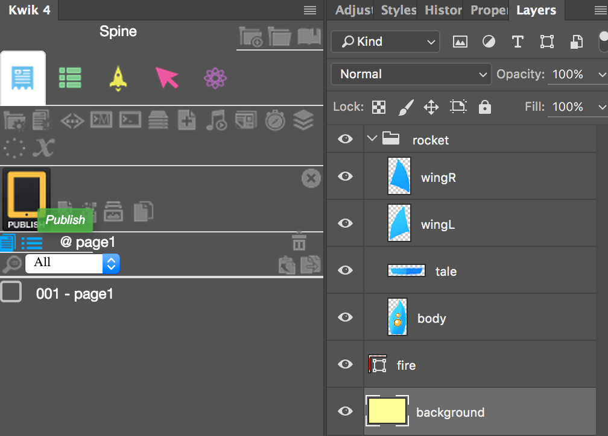
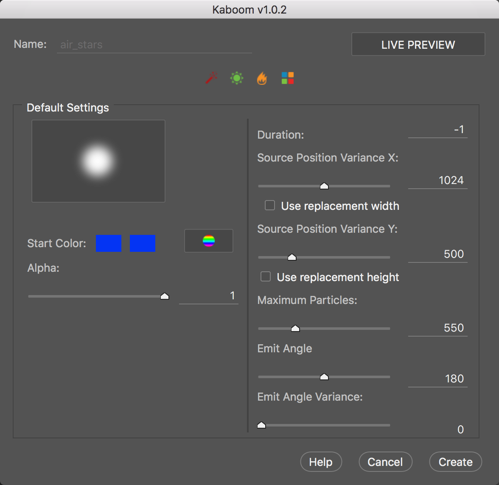

# Spine 

Spine is an animation tool that focuses specifically on 2D animation for games

* http://esotericsoftware.com/spine-quickstart

<iframe src="//www.youtube.com/embed/_70JQvzFfWs" width="560" height="314" allowfullscreen="allowfullscreen" />


Photoshop-LayersToPNG.jsx exports images in a layer group. You can import the exported images to Spine

* https://gist.github.com/NathanSweet/c8e2f6e1d79dedd56e8c

Let's create a rocket animation.
Sample project is here. 

* http://kwiksher.com/daily/blog/spine/Spine.zip


Steps
1. Create a new Kwik project
1. A layer group - rocket consists of body, wingR, wingL and tale
1. export the 'rocket' layer group with LayersToPNG.jsx
1. Open Spine and create a new spine project and import the parts of rocket
1. Make animations in Spine
1. Export the spine project. It outputs json, atlas and png files.
1. Kwik to publish the project and preview it with Corona simulator.
1. Create a custom file of rocket_image.lua to use the files(json, atlas, png) from Spine.
1. Publish again to make the custom file enable to work

## LayersToPNG
creating a new Kwik project and exporting the rocket parts with LayersToPNG.js

you can find layer png files and <strong>page1.json </strong>


Open Spine and import data. You can set page1.json from Browse button and set Skeleton name as" rocket". Then click OK


If Missing is displayed, you need to set the correct images folder


Set the images folder path from Tree Panel &gt; Images &gt; Path


select images folder and click Open to set the images folder.


Now the images are displayed


## Spine
You don't need to use  background image. So make it uncheck "Export". I modified the background color transparent to focus the rocket.


Set the center to the origin. This is important for importing the spine animation later to Kwik/Corona


### Making bones


Making animations. I named the animation as <strong>"animation"</strong>


### Export


Select JSON and Create atlas checked. Output folder is <strong>"build4/assets/sprites"</strong>


In the sample project, you can preview it with Corona simulator. Please open <strong>spine/main.lua</strong> with Corona simulator


## Kwik 

Now please go back to work with Kwik. Publish the project to generate the lua files.



You find <strong>rocket_image_.lua</strong> in build4/components/page01 folder


### Custom the file

* create page01 folder under \build4\custom\components\
* copy rocket_image_.lua to  \build4\custom\components\page01
* then edit the three functions. Add extlib.spine library, replace display.newImageRect for spine:newImageRect, add event functions.


Modify the custom rocket_image_.lua.  You need to use spine library and spine:newImagerect instead of display.newImageRect. Here is the three parts of modified custom/components/page01/rocket_image_.lua

```lua
local spine = require("extlib.spine").new("rocket")

function _M:localPos(UI)
  local sceneGroup  = UI.scene.view
  local layer       = UI.layer
    
    layer.rocket = spine:newImageRect( _K.imgDir..imagePath, imageWidth, imageHeight)

    layer.rocket.imagePath = imagePath
    layer.rocket.x = mX
    layer.rocket.y = mY
    layer.rocket.alpha = oriAlpha
    layer.rocket.oldAlpha = oriAlpha
    layer.rocket.blendMode = ""
    layer.rocket.oriX = layer.rocket.x
    layer.rocket.oriY = layer.rocket.y
    layer.rocket.oriXs = layer.rocket.xScale
    layer.rocket.oriYs = layer.rocket.yScale
    layer.rocket.name = "rocket"
    sceneGroup.rocket = layer.rocket
    sceneGroup:insert( layer.rocket)
  
end
```

###

* add layer.rocket.state:setAnimationByName(0, "animation", true)
* animation track 0 and "animation" with looping true

```lua
function _M:allListeners(UI)
  local sceneGroup  = UI.scene.view
  local layer       = UI

  layer.rocket.state:setAnimationByName(0, "animation", true)

end
```

###
dipose is added in _M:toDispose func
```lua
function _M:toDispose(UI)
  local sceneGroup  = UI.scene.view
  local layer       = UI.layer

  layer.rocket:dispose()

end
```

### Publish
press Publish on Kwik Panel to enable the custom file injected to the built codes.

### Copy Spine Files
Copy spine-corona, spine-lua folders and spine.lua in spine folder of Sample project and paste them like this

* build4/extlib/spine.lua
* build4/spine-corona
* buiild4/spine-lua


### Publish
Publish again to make the custom file enabled to work.


### Animation and Event Handling
For example, the following code is to change animation by touch event. You can add it to _M:localPos() function.

```lua
layer.rocket:addEventListener("touch", function (event)
    if event.phase ~= "ended" and event.phase ~= "cancelled" then return end
    local state = layer.rocket.state
    local name = state:getCurrent(0).animation.name
    if name == "animation" then
    state:setAnimationByName(0, "launch", false)
    elseif name == "launch" then
    state:setAnimationByName(0, "animation", true)
    end
end)
```

### Animation Mix

For example, the following code is loading **spineboy** sprite in rocket_image_.lua
newImageRect function has the 4th argument to set animation mix to make smooth transition

```lua
local spine = require("extlib.spine").new("spineboy", "walk") -- default animation is walk
layer.rocket = spine:newImageRect( _K.imgDir..imagePath, imageWidth, imageHeight,
    function(stateData)
        stateData:setMix("walk", "jump", 0.2)
        stateData:setMix("jump", "run", 0.2)
    end)
```

### Animation State Event
you can recive the events from the animation state with the following functions. Each function dispatches the event to the corresponding action. You need to create actions with the same names below in Kwik

* state_start
* state_interrupt
* state_end
* state_complete
* state_dispose
* state_event


Please add the following code to _M:localPos() function if you like to use the events
```lua
  layer.rocket.state.onStart = function(entry)
    UI.animName  = entry.animation.name
    UI.scene:dispatchEvent({name = "action_state_start", entry=entry })
  end
  
  layer.rocket.state.onInterrupt = function(entry)
    UI.animName  = entry.animation.name
    UI.scene:dispatchEvent({name = "action_state_interrupt", entry=entry })
  end
  
  layer.rocket.state.onEnd = function (entry)
    UI.animName  = entry.animation.name
    UI.scene:dispatchEvent({name = "action_state_end", entry=entry })
  end
  
  layer.rocket.state.onComplete = function (entry)
    UI.animName  = entry.animation.name
    UI.scene:dispatchEvent({name = "action_state_complete", entry=entry })
  end
  
  layer.rocket.state.onDispose = function (entry)
    UI.animName  = entry.animation.name
    UI.scene:dispatchEvent({name = "action_state_dispose", entry=entry })
  end
  
  layer.rocket.state.onEvent = function (entry, event)
    UI.animName  = entry.animation.name
    UI.eventName = event.data.name
    UI.scene:dispatchEvent({name = "action_state_event", entry=entry })
  end

  ```

### By the way, 
the sample project used Particles replacement. The fire layer and the background are replaced with the particles.


You can find the sample particles in CoronaSDK_Emitter_Viewer_Sample folder.



I changed the emit angle as 180 for air_stars.  Editing particles(Kaboom) on Kwik4 is only available for users who purchased a Kwik license. 

Enjoy
